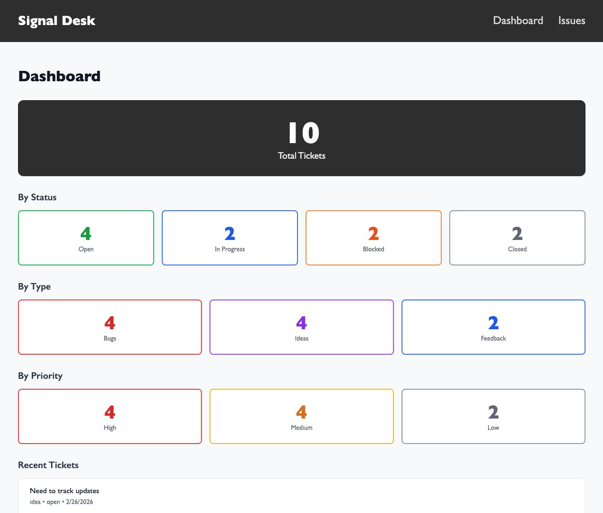
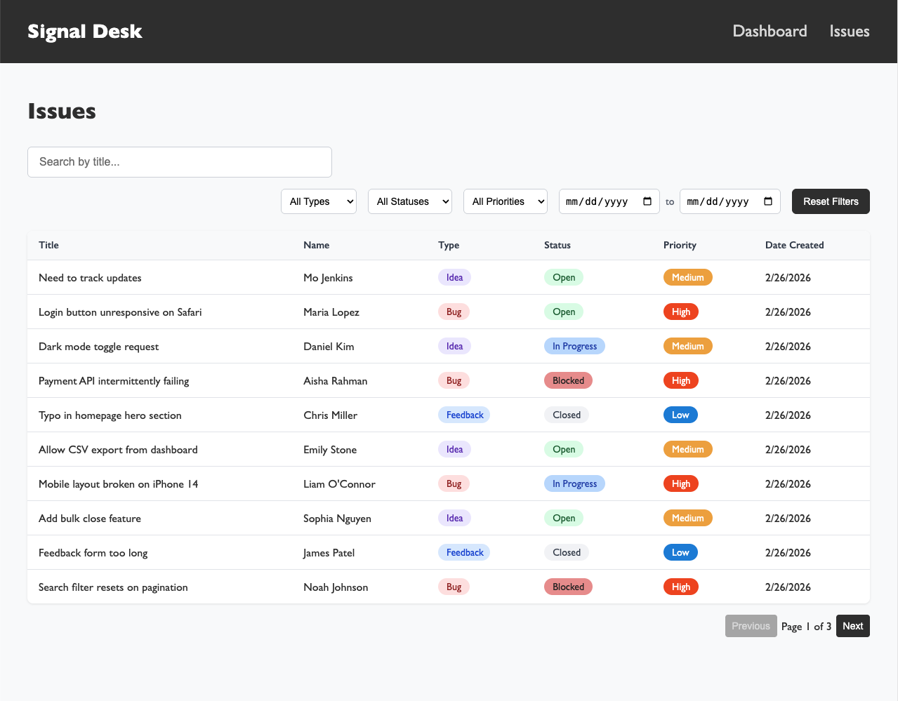
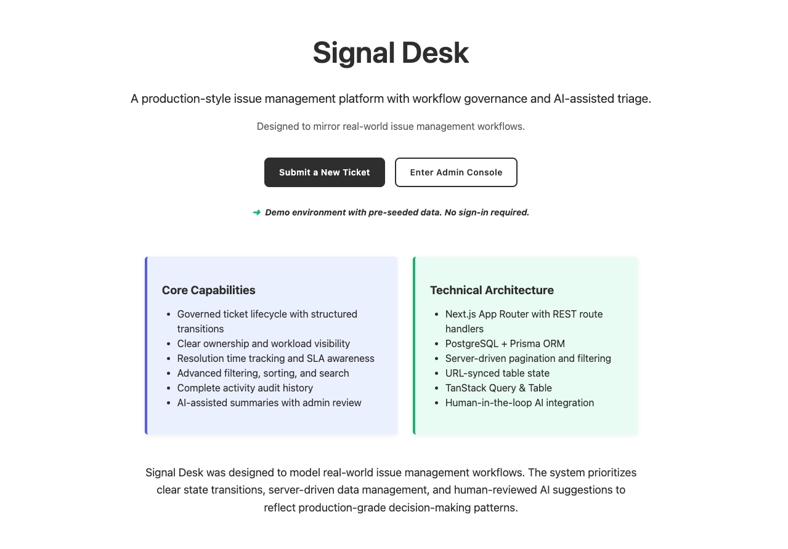

# Signal Desk

A full-stack issue tracking system for managing bug reports, ideas, and feedback.

## Live Link

See it Live here - https://signal-desk-delta.vercel.app/

## Features

**Public Submission**
- Submit tickets with title, description, type, and priority
- Drag-and-drop file upload
- Form validation and error handling

**Admin Dashboard**
- Overview stats (total, by status, by type, by priority)
- Clickable stat cards to filter issues

**Issue Management**
- View all tickets in a filterable table
- Search by title
- Filter by type, status, priority, and date range
- Pagination for large datasets
- Edit ticket status and priority with inline controls
- Conflict detection for concurrent edits

## Tech Stack

- **Framework:** Next.js 15 (App Router)
- **Language:** TypeScript
- **Database:** SQLite with Prisma ORM
- **Styling:** CSS Modules

## Getting Started

### Prerequisites

- Node.js 18+
- npm or yarn

### Installation

1. Clone the repository
```bash
   git clone https://github.com/yourusername/signal-desk.git
   cd signal-desk
```

2. Install dependencies
```bash
   npm install
```

3. Set up the database
```bash
   npx prisma migrate dev --name init
```

4. Create a `.env` file

DATABASE_URL="file:./prisma/dev.db"

5. Start the development server
```bash
   npm run dev
```

6. Open [http://localhost:3000](http://localhost:3000)

## Project Structure

signal-desk/
├── app/
│   ├── (public)/submit/     # Public ticket form
│   ├── admin/
│   │   ├── dashboard/       # Stats overview
│   │   └── issues/          # Ticket list & detail
│   └── api/tickets/         # REST API
├── components/              # Reusable components
├── lib/                     # Utilities & types
└── prisma/                  # Database schema

## API Endpoints

| Method | Endpoint | Description |
|--------|----------|-------------|
| GET | `/api/tickets` | List all tickets (with pagination & filters) |
| POST | `/api/tickets` | Create a new ticket |
| GET | `/api/tickets/[id]` | Get a single ticket |
| PATCH | `/api/tickets/[id]` | Update ticket status/priority |

## Demo Access

- **Landing Page:** [/](http://localhost:3000)
- **Submit a ticket:** [/submit](http://localhost:3000/submit)
- **Admin dashboard:** [/admin/dashboard](http://localhost:3000/admin/dashboard)
- **View issues:** [/admin/issues](http://localhost:3000/admin/issues)

*Note: Authentication is disabled for demo purposes. In production, admin routes would be protected.*

## Roadmap

Planned features for future development:

- [ ] **Authentication** - Protect admin routes with NextAuth.js
- [ ] **File uploads** - Store attachments in cloud storage (Vercel Blob/S3)
- [ ] **Email notifications** - Notify users when ticket status changes
- [ ] **Comments** - Add discussion threads to tickets
- [ ] **Audit log** - Track all changes to tickets
- [ ] **Bulk operations** - Select and update multiple tickets at once
- [ ] **Export** - Download tickets as CSV
- [ ] **Dark mode** - Theme toggle for admin interface

## Architecture Decisions

- **Why SQLite?** Simple setup for demo/portfolio. Easy to migrate to PostgreSQL for production.
- **Why CSS Modules?** Scoped styles without extra dependencies. Keeps bundle small.
- **Why App Router?** Latest Next.js patterns. Server components where possible.
- **Why optimistic locking?** Prevents data loss when multiple admins edit the same ticket.

## Screenshots

### Admin Dashboard


### Issues List


### Submit Form
